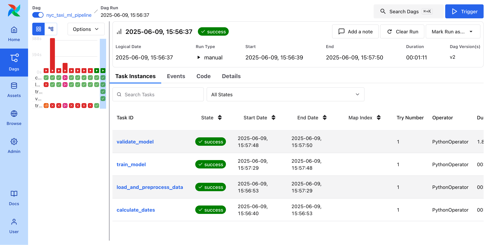

## ML pipeline orchestration

For this week, I learned about how to orchestrate a ml pipeline (data loading, feature engineering, model training, model evaluation, etc) using **Apache Airflow** and **MLflow**.

### Technical setup

* OS: macOS Sequoia 15.5 (chip M2)
* vs code
* Issues:
  * I could not make apache airflow work on my mac with python versions higher than 3.9. So in the end I created a virtual env with python 3.9. Essentially, I used airflow version *3.0.1* and mlflow version *2.19.0*.
  * I kept the original ports: 8080 for airflow and 5000 for mlflow
  * For saving files on airflow, beware not to save complex objects in XCom, and prefer saving them locally for example in a temporary folder.
  * When getting data from XCom, it is important to specify `task_ids` and not only `key`.
  * Be ready to debug a little.

### Results

### Learning resource

* For a quick overview of Apache airflow: [Sleek Data airflow playlist](https://www.youtube.com/playlist?list=PLc2EZr8W2QIAI0cS1nZGNxoLzppb7XbqM)